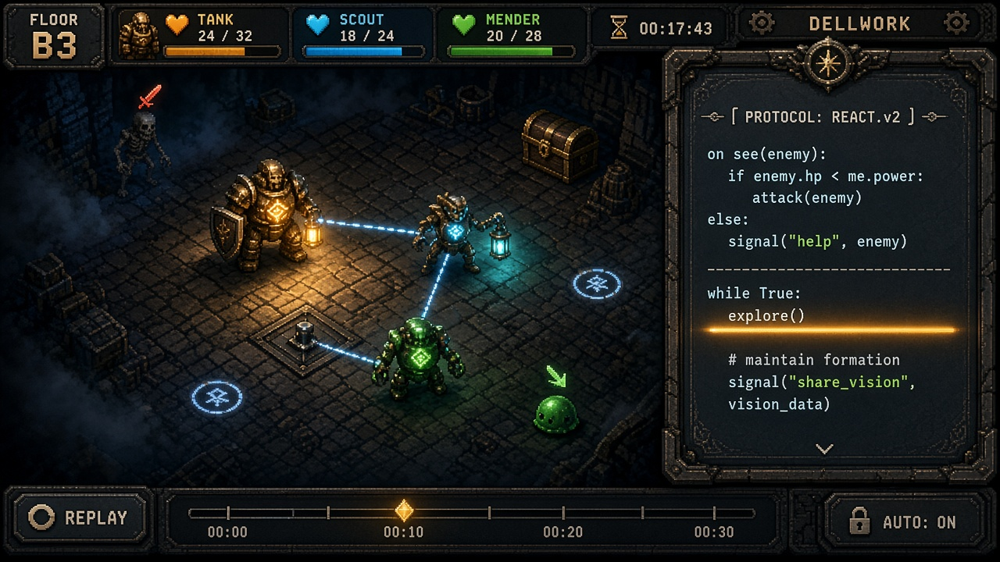
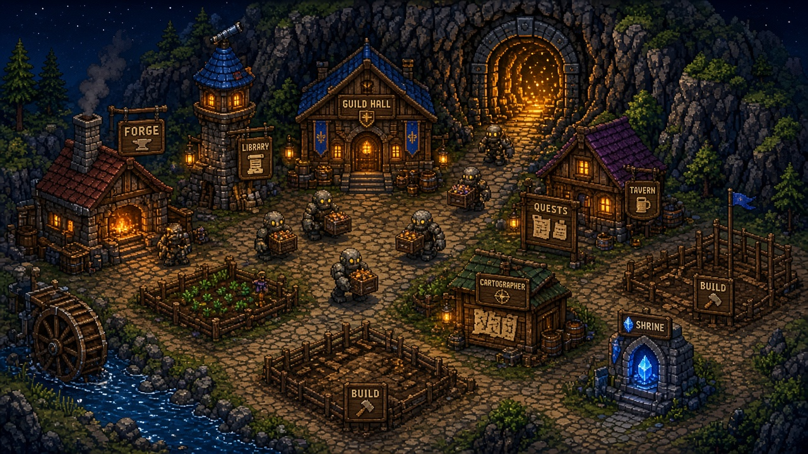

# Delvework — Concept

*Working title. A programming dungeon crawler with a town that grows from what your code brings back.*



> Concept art is AI-generated placeholder for direction only. Text in the art is not final,
> and the sample code in it isn't valid Glyph.

---

## Pitch

The mountain town of Hollowmere sits on top of an endless dungeon. Nobody who goes down
comes back, so the town's last artificer (you) stopped sending people. You send **golems**
instead.

You **never control a delve live.** You engrave programs into your golems' rune cores, send
the party down, and watch what your code does. When they come back (or don't), you study the
replay, fix your code, and spend the loot on growing the town above.

**Hook:** *Write the AI for your own dungeon party. Then read the monsters' code, and out-program them.*

---

## Pillars

1. **Your code is the party's brain.** There's no manual combat and no clicking during a delve. Preparation, observation and debugging are the gameplay.
2. **Monsters are programs too.** Every monster runs a readable script. Studying monsters in the Bestiary reveals their source code, and countering it is the core of combat.
3. **The town is your progress.** Loot builds and upgrades buildings. Each building unlocks language features, golem hardware, or new ways to delve. You watch Hollowmere grow from a ruin to a lively town.
4. **Failure is data.** Broken golems are salvaged, not lost. Every run leaves a full replay you can scrub, step through and inspect.
5. **Fair and deterministic.** The same seed and the same code always give the same result. That enables replays, daily challenges and trustworthy leaderboards.

---

## How a run works

```
 TOWN (plan)                    DUNGEON (watch)                 TOWN (learn)
 ─────────────                  ───────────────                 ────────────
 write / edit code      ──►     party delves on its own  ──►    scrub the replay
 choose golems + chips          fog of war, traps, loot          read new Bestiary entries
 pick a floor or contract       monsters run their scripts       spend loot, build, upgrade
         ▲                                                               │
         └───────────────────────────────────────────────────────────────┘
```

- **Delves are short:** a floor takes 1–3 minutes to watch at normal speed, with 1×/4×/16× fast-forward and instant simulation for repeat runs.
- **Recall:** golems carry a limited-use Recall Stone. Your code decides when to use it, for example `if party.hp < 0.3: recall()`.
- **Soft roguelite:** floors are procedurally generated from a seed. Loot carried back is kept; golems that break drop their chips on the floor, and the next party can retrieve them.

---

## The party: golems

- Up to **4 golems** per party (1 at the start).
- **Chassis** set base stats and a role: Warden (tank), Seeker (scout, lantern), Mender (heals and repairs), Arcanist (ranged), Delver (mining and traps).
- **Rune core** = the program. Cores have a **capacity in instructions per tick**, and bigger cores are crafted at the Forge. Efficient code does more per tick.
- **Chips** go into chassis slots: sensors (see further, see through walls, identify traps), tools (pick, lockpick, lantern), weapons, and comms (signals between golems).
- **Signals:** `signal("help", target)` together with `on signal "help":` handlers is how party coordination works. This is the mechanic that makes party play interesting.

---

## Monsters as code

- Every monster has a behaviour script written in the same language as yours.
- **Encountering** a monster adds a Bestiary entry with stats. **Studying** it (by defeating
  it several times or bringing back remains) progressively reveals its script:
  first the triggers, then the full source.
- **Intent icons** above monsters show their next action on screen, so a good program can react.
- Bosses are **multi-phase scripts**, and learning their state machine is the puzzle.
- Late game: **Hexes** are enemy chips that modify your golems' code, for example by swapping
  `left` and `right` or disabling a function, until they're cleansed at the Shrine.

---

## The town: Hollowmere



The hub is a small, walkable, top-down town. It starts as ruins with a single working Forge.

| Building | What it gives you |
|---|---|
| **Forge** | Craft chassis, cores and chips; repair golems |
| **Library** | Unlocks **language features** (functions, lists, dicts, events, modules) and holds the manual |
| **Cartographer** | Map memory API (`map.known()`, `path_to()`), floor previews, seed selection |
| **Guild Hall** | Party size +1 per upgrade, signals, formations |
| **Tavern** | Contracts board: handmade puzzle floors with score histograms and leaderboards |
| **Bestiary Hall** | Stores monster studies and reveals monster scripts |
| **Shrine** | Cleanses Hexes; extra Recall Stones |
| **Market** | Trade loot types; daily rotating stock |
| **Workshop** | Script the **town's own automation** (mine carts, sorting loot, crafting queues), as a late-game second programming layer |
| **Observatory** | Daily Delve (shared seed, global leaderboard) and weekly challenge modifiers |
| **Archive** | Save, version and share programs (Steam Workshop integration) |
| **Houses** | Townsfolk move in as the town grows, giving small bonuses and flavour quests |

Every building has **3 upgrade levels**, and each level visibly changes its sprite. The town is
the "look how far I came" screen.

---

## The language: Glyph

A **Python-flavoured** language, so the skill transfers to real programming. What sets it
apart are the domain features: event handlers, per-golem programs, a shared party state,
and a per-tick instruction budget.

```python
# warden.glyph: hold the front, protect the mender
on see(enemy):
    if enemy.intent == Intent.Charge:
        brace()
    elif distance(enemy) <= 1:
        attack(enemy)

on signal "help" (target):
    move_toward(target)

while True:
    mender = party.get(Role.Mender)
    if mender and distance(mender) > 2:
        move_toward(mender)
    else:
        explore()
```

```python
# seeker.glyph: scout ahead, mark traps, report back
while True:
    tile = sense_ahead()
    if tile.trap:
        mark(tile, "trap")
        signal("avoid", tile)
    if party.hp < 0.3:
        recall()
    explore(prefer=Unexplored)
```

- **Feature ladder (Library):** `move`/`attack`/`if`/`while`, then variables, then functions,
  then lists, then events (`on see`, `on hurt`, `on signal`), then dicts, then modules
  (`import tactics`), then coroutines (`wait_until`).
- **Engineer mode:** all features unlocked from the start for experienced programmers.
- **Tooling:** autocomplete, inline errors, hover docs linked to the Bestiary, a **replay
  debugger** (scrub, step one golem, inspect its variables, see its path), and breakpoints
  that pause the replay.

---

## Visual style

- **Perspective and art:** top-down 3/4 pixel art with 32px tiles. It's readable, cheap to
  produce, and a proven look on Steam.
- **The dungeon is dark by default.** Dynamic 2D lighting comes from golem lanterns, rune cores and torches. Fog of war covers anything no golem has seen.
- **Rune cores glow with the code.** A golem's chest rune pulses whenever its program runs an
  instruction, and flashes a colour on events. You can literally see which golem is "thinking".
- **Each dungeon stratum has its own palette:** Mines (amber and rust), Flooded Halls (teal),
  Fungal Deep (violet), Clockwork Vault (brass), The Hollow (monochrome with a red accent).
- **The town is the warm contrast**, with window light, smoke and golems hauling crates. It gets busier and brighter with every building.
- **Diegetic UI:** the editor is a carved stone tablet with glowing engraved code, the
  Bestiary is a leather-bound book, and the replay timeline looks like a brass instrument.
- **Audio:** dungeon ambience plus adaptive combat layers; the town theme gains instruments as buildings are restored.

---

## What carries over from earlier ideas

- **From the Drone Farm prototype:** the Python-like lexer, parser, test suite and the "code costs time" model.
- **From the Rewild plan:** swarm-style coordination (now party signals), hardware chips,
  replay and step debugging, a deterministic simulation, contracts with histograms, and the
  "world visibly comes alive" progress (now the town).
