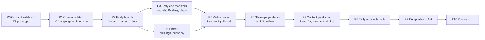

# Delvework — Full Roadmap

This is the complete plan from prototype to Steam 1.0 and beyond. See [CONCEPT.md](CONCEPT.md) for the game itself.

**How to read this:**
- The work is split into **phases**. Each phase has a goal, deliverables per workstream, and
  **exit criteria** that must all be true before the next phase starts. Phases are gated by
  outcomes, not by dates.
- **Workstream tags:** `LANG` (Glyph language), `SIM` (simulation), `DUN` (dungeon
  content), `TOWN`, `TOOL` (editor and debugger), `ART`, `AUD` (audio), `UX` (onboarding
  and interface), `PLAT` (Steam and platform), `INFRA` (build, CI and QA), `MKT` (marketing), `LOC` (localisation).
- Items marked **[cut line]** are the first to drop if scope has to shrink.

---

## 0. Target scope for 1.0

This is what "done" means. Every phase below builds toward these numbers.

| Area | 1.0 target | Early Access launch target |
|---|---|---|
| Dungeon strata (biomes) | 5 strata × 5 floors + 1 boss each, then an endless "Hollow" | 2 strata + bosses |
| Monster types | 30 regular + 5 bosses, all with readable scripts | 12 regular + 2 bosses |
| Golem chassis | 5 (Warden, Seeker, Mender, Arcanist, Delver) | 3 (Warden, Seeker, Mender) |
| Chips | ~40 | ~15 |
| Town buildings | 12, with 3 levels each | 7 |
| Glyph language tiers | 8 (full ladder) | 6 |
| Contracts (puzzle floors) | 40 + weekly | 15 |
| Daily Delve and leaderboards | Yes | Yes |
| Steam Workshop (programs and contracts) | Yes | Programs only |
| Achievements | ~50 | ~20 |
| Languages | EN + 5 (DE, FR, ES, PT-BR, ZH-CN); NL optional | EN |
| Steam Deck | "Playable", keyboard needed for coding | Not rated |

---

## 1. Architecture decisions (locked in Phase 1)

| Decision | Choice | Reason |
|---|---|---|
| Engine | **Godot 4 .NET (C#)** | Free; strong 2D and lighting; `CodeEdit` control; simple desktop exports; Steam Deck friendly |
| Core library | **`Delvework.Core`**: pure C# with no Godot references | Language and simulation are testable, deterministic, and run headless (CI, leaderboard verification) |
| Language implementation | Lexer, parser, **bytecode compiler, stack VM** | Exact per-tick instruction budgets; pause and resume anywhere; fast enough for 4 golems plus about 60 monsters at 16× |
| Simulation | **Fixed-tick** (10 ticks per simulated second), integer and fixed-point math, one seeded RNG per run | Bit-exact determinism, so replays are stored as seed, code and inputs rather than recorded frames |
| Replays | Keyframe snapshots every 50 ticks plus deterministic re-simulation | Instant scrubbing without huge files |
| Saves | JSON (versioned schema) plus Glyph source files in a folder | Human-readable, mod-friendly, Steam Cloud compatible |
| Steam | Steamworks.NET (or Facepunch.Steamworks) | Achievements, Cloud, leaderboards, Workshop, rich presence |
| Art pipeline | Aseprite, then sprite sheets, Godot import presets; 32px grid | Standard, cheap, and consistent |
| Audio | FMOD or Godot native with layered stems | Adaptive music layers |

**Solution layout:**

```
Delvework/
  src/Delvework.Core/          # no engine dependencies
    Glyph/                     # Lexer, Parser, Ast, Compiler, Vm, Stdlib
    Sim/                       # World, Tick, Entities, Combat, Fov, Pathing, Rng
    Dungeon/                   # Generation, Rooms, Traps, Loot tables
    Town/                      # Buildings, Economy, Unlocks
    Replay/                    # Snapshots, Recorder, Player
    Content/                   # Data definitions (monsters, chips, contracts) loaded from JSON
  src/Delvework.Cli/           # headless runner: run seed + code, print results or verify replays
  tests/Delvework.Core.Tests/  # xUnit: language, simulation, determinism, golden replays
  game/                        # Godot project (rendering, UI, audio, Steam)
  content/                     # JSON and Glyph data: monsters/*.glyph, chips.json, strata/*.json
  tools/                       # content validators, balance simulators
```

---

## 2. Phase overview



Phases 3 and 4 can run in parallel once Phase 2 is done: combat and dungeon work (SIM, DUN)
on one side, town and economy (TOWN) on the other.

---

## Phase 0: Concept validation (TypeScript prototype)

**Goal:** prove that writing a party AI, then watching and debugging it, is fun, using the
fastest tool available: the existing web prototype. None of this code ships.

**Deliverables:**
- `SIM`: turn the farm grid into a dungeon grid with walls, a small hand-made room layout,
  fog of war, one chest, one trap, and two monster types (a Slime that moves randomly, and a
  Skeleton that chases on sight).
- `LANG`: add `on see(enemy):` events, `attack()`, `sense_ahead()`, and `recall()` to the
  existing interpreter.
- `SIM`: 1–2 golems, basic combat (HP, damage, tick-based turns), and death leading to salvage.
- `TOOL`: a simple replay (record states, scrub with a slider) and an "intent" icon above each monster.
- `TOWN` (paper only): sketch the building to unlock progression on paper; no code.

**Playtest protocol:** 5 people, two of them non-programmers. Watch them without helping.

**Exit criteria:**
- [ ] At least 4 of 5 testers voluntarily edit their code to beat the Skeleton after losing to it once.
- [ ] Testers describe the replay as useful, without being prompted.
- [ ] At least one "aha" moment is observed: a tester reads monster behaviour and counter-programs it.
- [ ] Decision recorded: turn-based ticks versus near-real-time ticks (the default plan is 10 ticks per second with instant fast-forward).

**Kill or pivot signal:** if watching isn't fun even with fast-forward, pivot toward
turn-by-turn stepping where every tick is a puzzle, which would be a Zachtronics-style design.

---

## Phase 1: Core foundation (C#)

**Goal:** a headless, deterministic, fully tested core that the Godot game sits on top of.

**Deliverables:**

`LANG`: Glyph v1
- Lexer with indentation, and a parser producing an abstract syntax tree (port from the TS prototype, including its tests).
- Bytecode compiler and a stack VM: `Step(budget)` runs up to N instructions and returns a
  status (Running, Yielded on an action, Blocked, Done, or Error with the line number).
- Values: int, float (fixed-point for simulation use), bool, string, None, list, dict,
  function, and enum. Standard library: `range`, `len`, `min`, `max`, `abs`, `str`, `int`, `print`.
- Event handlers: `on <event>(args):`. The VM keeps a handler queue; when an event fires, the
  handler runs and then the main program resumes where it left off.
- A capability gate, where each builtin and syntax feature has a required tier. Using a locked
  feature produces a friendly compile error.
- Resource limits: recursion depth, a list size cap, and an instruction cap per tick.
  **No infinite loop can ever freeze the game.**

`SIM`
- Grid world, entities (golems, monsters, items, traps), and the fixed-tick loop.
- Field of view (shadowcasting), a fog-of-war memory per party, and A* pathing (`path_to`).
- Combat model: HP, armor, damage types, cooldowns, and status effects (Stun, Burn, Slow).
- Deterministic RNG streams (dungeon generation, combat, loot) derived from the run seed.

`DUN`
- Room-and-corridor generator with seeded templates, and placement of traps, loot and monsters from stratum tables.

`Replay`
- Recorder (seed, code hashes, content version) plus keyframes, and a player that can seek to any tick.

`INFRA`
- Repository, `dotnet test` in CI on every push, and code formatting and analyzers.
- **Determinism test:** run 1,000 random seeds with sample programs twice and compare state hashes, on both Windows and Linux runners.
- **Fuzz test:** random and mutated Glyph source must never crash the VM; only clean errors are allowed.
- **Performance benchmark:** 4 golems plus 60 monsters with 200 instructions per tick each, running at least 1,000 ticks per second on a mid-range CPU.
- `Delvework.Cli run --seed 42 --party warden.glyph,seeker.glyph` prints the outcome.

**Exit criteria:**
- [ ] All TypeScript prototype language tests are ported and passing, plus 150 or more new tests.
- [ ] The determinism test passes across platforms.
- [ ] The fuzz test runs for 1 hour with zero crashes.
- [ ] The performance benchmark target is met.
- [ ] A command-line demo can play a full generated floor headlessly.

---

## Phase 2: First playable (Godot)

**Goal:** the smallest version you'd hand to a friend: one golem, one floor type, a stub town, and the full edit, delve and replay loop.

**Deliverables:**
- `ART` (placeholder quality is fine): dungeon tileset (stratum 1), one golem, three monsters, chest, trap, and a town ground plus 2 buildings.
- `SIM` and `game/`: renderer that follows simulation state with interpolated movement, light
  sources, fog-of-war shader, and intent icons.
- `TOOL`:
  - Code editor on Godot `CodeEdit` with Glyph syntax highlighting, autocomplete for builtins
    and variables in scope, and error squiggles with messages.
  - Run controls: Delve, Pause, 1×/4×/16×, and Skip-to-result.
  - Replay timeline: scrub, highlight the current line per golem, and a variables panel for the selected golem.
- `TOWN` stub: walkable town with a Forge (repair, one chip) and a Library (Tier 2 language unlock). The dungeon entrance starts a delve.
- `UX`: title screen, settings (resolution, volume, font size, editor keybindings), and save/load of one slot.
- `INFRA`: nightly Godot export for Windows and Linux; a crash reporter (Sentry or similar) with opt-in.

**Exit criteria:**
- [ ] A new player can complete the loop (write code, delve, die, read the replay, fix the code, succeed) without help, in 3 of 5 playtests.
- [ ] No crash in 2 hours of continuous play.
- [ ] The editor passes an "it feels like a real editor" check: undo/redo, selection, indentation, find, and fonts all work properly.

---

## Phase 3: Party and monsters (signature systems)

**Goal:** the systems that make Delvework unique: party coordination, readable monster scripts, and hardware choices.

**Deliverables:**
- `SIM` and `LANG`: **party**
  - Up to 3 golems in this phase (4 in Phase 7); one program file per golem.
  - `signal(name, data)` and `on signal name(data):`, a shared read-only `party` object (members, HP, positions), and marks on tiles (`mark(tile, tag)`).
  - Chassis: Warden, Seeker and Mender, each with 2–3 unique actions (`brace`, `scan`, `repair`).
- `SIM`: **cores and chips**
  - Core capacity (instructions per tick) as a stat; chip slots per chassis.
  - 15 chips across the categories sensor, tool, weapon, comms and utility.
- `DUN` and `LANG`: **monsters as Glyph**
  - Monster behaviour scripts are written in Glyph, stored in `content/monsters/*.glyph`, and run on the same VM.
  - 12 monsters for strata 1–2; each has 1–2 exploitable patterns.
  - Intent system: monsters declare their next action a tick ahead, shown as an icon and readable through `enemy.intent`.
- `TOOL`: **Bestiary**
  - Discovery states: Unknown, then Seen (stats), then Studied (triggers), then Mastered (full source view with syntax highlighting).
  - Hover a monster in a replay to see which line of *its* script is running. **[cut line: this hover view]**
- `TOOL`: the debugger gains per-golem step, breakpoints (a pause trigger in replay), a path overlay, and the signal log.
- `UX`: an in-game Manual (the Library book), plus a contextual help panel generated from builtin metadata.

**Exit criteria:**
- [ ] Playtesters write at least one program that uses signals between golems without a tutorial telling them to.
- [ ] Playtesters use the Bestiary source view to beat a monster they previously lost to.
- [ ] 3 distinct viable party builds exist for Stratum 1, verified by the balance simulator.

---

## Phase 4: Town and economy (in parallel with Phase 3)

**Goal:** Hollowmere becomes the progression spine and the "look how far I came" screen.

**Deliverables:**
- `TOWN`: building system with plots, construction costs, 3 upgrade levels, and a sprite change at each level.
- **7 buildings for Early Access:** Forge, Library, Cartographer, Guild Hall, Tavern, Bestiary Hall, Shrine.
- **Economy:**
  - Loot types: Ore, Scrap, Crystal, Relics (rare), and Monster Essence (needed to study monsters).
  - Sinks: construction, chips, repairs, and contract entry fees.
  - A balance spreadsheet plus the `tools/` economy simulator, which runs 1,000 simulated
    progressions using the sample programs to find time-to-unlock curves.
- **Unlock map:** see §4 below; implemented as data in `content/unlocks.json`.
- `ART`: town tileset, 7 buildings × 3 levels, townsfolk (4 NPCs), and golems hauling crates (ambient).
- `AUD`: town theme with layers that turn on per building restored.
- `UX`: town-to-dungeon transition, loot summary screen after each delve ("what came back, what broke, what was learned").

**Exit criteria:**
- [ ] The economy simulator shows no dead ends: every unlock is reachable with the programs available at that point.
- [ ] The first 60 minutes are paced so the player unlocks something at least every 8–10 minutes.
- [ ] Testers bring up town growth as a motivation in feedback.

---

## Phase 5: Vertical slice (Stratum 1 polished)

**Goal:** the first 60–90 minutes at release quality. This is what the Steam page, trailer and demo are built from.

**Deliverables:**
- `DUN`: Stratum 1 **"The Old Mines"** with 5 floors, a floor-5 boss (**Foreman**, a 3-phase script), traps, secrets, and a mining sub-mechanic for Delvers.
- `ART`: final-quality stratum 1 tileset, 3 chassis with full animation sets (idle, walk, act, hurt, break), 6 monsters, the boss, VFX (rune glow, signals, hits), and the lighting pass.
- **Signature visual:** golem rune cores pulse per instruction executed and flash on events.
- `ART`: town with final art for the 7 buildings (level 1) and the Forge up to level 3.
- `AUD`: stratum 1 ambience, combat layers, the boss theme, and a full SFX pass.
- `UX`: **onboarding.** Five short guided floors ("The First Engraving") that teach move,
  attack, if, events and signals. Each can be skipped, and Engineer mode skips them all.
- `UX`: accessibility (font scaling, colour-blind-safe intent icons, reduced motion, remappable editor keys).
- `PLAT`: Steam app ID, depots, and achievements set up (stubbed), plus Steam Cloud for saves.

**Exit criteria:**
- [ ] 10 external playtesters: median session of at least 45 minutes; at least 70% say they'd buy or wishlist it.
- [ ] Trailer-worthy footage: at least 5 clips under 15 seconds that read without sound.
- [ ] Zero known crash bugs and zero progression blockers.

---

## Phase 6: Steam page, demo, and Next Fest

**Goal:** build wishlists and validate demand before full content production.

**Deliverables:**
- `MKT` Steam page: capsule art (commissioned), 5+ screenshots, a GIF-heavy description, and
  tags (Programming, Automation, Dungeon Crawler, Roguelite, Pixel Graphics, Strategy, Base Building).
- `MKT`: a 60–90 second trailer structured as hook (code line, golems react), town growth, a
  monster script reveal, the party coordinating, and then the wishlist call.
- `PLAT`: **demo build.** Onboarding plus floors 1–3 plus a town with 3 buildings; saves carry over to the full game.
- `MKT`: press kit, a devlog cadence (short GIFs of emergent golem behaviour), and outreach to
  programming-game communities and to creators who covered The Farmer Was Replaced, Bitburner and Zachtronics games.
- `INFRA`: opt-in telemetry (where players quit, which errors they hit, time to first success).
- **Next Fest participation:** a live-streamed "programming the Foreman" session.

**Exit criteria (go/no-go for full production):**
- [ ] Wishlist trajectory reaches the internally set threshold before Early Access. Set the number when the page launches.
- [ ] The demo's median playtime and review sentiment clear their thresholds.
- [ ] Telemetry has identified the top 10 friction points, and they're triaged.

---

## Phase 7: Content production (toward Early Access)

**Goal:** reach the Early Access target scope in §0 with the systems stable.

**Deliverables:**
- `DUN`: Stratum 2 **"Flooded Halls"** (water flow, drowning, currents that push golems, electric monsters), 5 floors, and a boss (**The Tidewarden**).
- `DUN`: monsters up to 12 regular and 2 bosses.
- `SIM`: chips up to ~15; 4-golem parties via Guild Hall level 2.
- `LANG`: tiers 1–6 complete (see §5).
- `TOWN`: all 7 Early Access buildings with 3 levels each, plus Houses and townsfolk quests. **[cut line: quests]**
- **Contracts:** 15 handmade puzzle floors, scored on ticks, instructions executed, lines of
  code, and golems used. Each score is shown as a histogram against all players.
- **Daily Delve:** a shared seed each day, one attempt per program version, and a global leaderboard (verified by the headless CLI on a small server, or signature-checked replays).
- `PLAT`: Workshop for sharing programs, the achievements list (~20), and rich presence ("Floor B7 · 3 golems").
- `LOC`: string externalisation is done, even though only English ships at Early Access.
- `INFRA`: a golden-replay regression suite (100 recorded runs must re-simulate identically after each change).

**Exit criteria:**
- [ ] About 8–12 hours of content for a typical player, measured in playtests.
- [ ] Balance simulator: every stratum is beatable with at least 3 different party archetypes.
- [ ] Golden replays pass; zero progression blockers; crash rate below 0.5% of sessions in beta.

---

## Phase 8: Early Access launch

**Why Early Access:** programming games live on community feedback, and the Early Access
community will produce the best programs, contracts and bug reports. The systems are
designed to be data-driven, so content can be added without engine work.

**Launch checklist:**
- [ ] Store page updated with an Early Access FAQ: what's in, what's planned, rough scope of 1.0.
- [ ] Price set with a launch discount. Early Access is cheaper than 1.0.
- [ ] Builds for Windows and Linux. macOS if the Steamworks.NET and Godot export pipeline is stable (optional).
- [ ] Achievements, Cloud, leaderboards and Workshop verified on a clean account.
- [ ] Discord server with #bug-reports, #share-your-code, and #contracts channels.
- [ ] Hotfix pipeline: a branch, a one-command build, and an upload to the Steam beta branch.
- [ ] Day-one patch notes template; public roadmap board.

---

## Phase 9: Early Access updates to 1.0

Each major update is themed and fixes feedback from the previous one.

| Update | Headline content | Systems |
|---|---|---|
| **U1 "Fungal Deep"** | Stratum 3 (spores, spreading hazards, mind-control monsters), 6 monsters, boss | Tier 7 language (modules/`import`); **Hexes** (enemy code corruption) |
| **U2 "The Workshop"** | Town automation: scripting mine carts and crafting queues in Glyph | Second programming layer; Workshop building; Market |
| **U3 "Clockwork Vault"** | Stratum 4 (timed doors, conveyor floors, clockwork enemies that run on exact tick patterns) | Tier 8 language (`wait_until`, coroutines); Arcanist chassis |
| **U4 "The Hollow"** | Stratum 5 plus the endless depth mode with scaling modifiers | Delver chassis; Observatory weekly challenges; Workshop contracts (player-made floors) |
| **1.0** | Final boss, ending, town completion epilogue, 40 contracts, 50 achievements | Localisation for 5 languages, Steam Deck "Playable", final balance, and a performance pass |

**1.0 exit criteria:**
- [ ] All §0 targets met.
- [ ] Review score is steady or improving across Early Access updates.
- [ ] Deck verification submitted; localisation QA passed.

---

## Phase 10: Post-launch

- A free contract pack every season, curated from the best Workshop floors.
- A **"Code Golf" weekly**: fewest instructions to clear a fixed floor.
- A possible paid expansion: a second town and dungeon (volcanic or sky ruins) with new chassis. **[cut line]**
- A possible mod API that exposes content JSON and Glyph monster scripts for community strata.

---

## 3. Workstream deep dives

### 3.1 Glyph language (`LANG`)

| Component | Phase | Notes |
|---|---|---|
| Lexer and parser | P1 | Port from the TS prototype; add `on`, dicts, and the `import` syntax (parsed but gated) |
| Compiler to bytecode | P1 | Constant folding; jump patching for loops and `break`/`continue`; line table for debugging |
| VM | P1 | Stack VM; `Step(budget)`; actions yield the golem's turn; handler queue |
| Error messages | P1–P5 | Friendly messages with "did you mean" (edit distance against names in scope) and a docs link |
| Capability tiers | P1 | Checked at compile time, so locked features are reported before the delve starts |
| Standard library docs | P2 | Generated from builtin metadata, which also powers autocomplete and hover |
| Monster scripting | P3 | Same VM, with a restricted monster API and a monster-side budget |
| Modules | U1 | `import tactics` loads a file from the Archive; no circular imports |
| Coroutines | U3 | `wait_until(cond)`, `wait(ticks)` |
| Town scripting | U2 | Same language, with a different API surface (`cart.load()`, `forge.queue()`) |

**Instruction cost model:** 1 point per VM instruction, and builtin calls cost what they
declare (`sense_ahead` 3, `path_to` 10 + path length / 4). The per-tick budget comes from the
core; if a golem is over budget it continues next tick, which visibly slows it down.

### 3.2 Simulation and combat (`SIM`)

- **Tick order:** events are dispatched first, then golem programs are stepped in party order,
  monster scripts next, then the resolution phase (movement conflicts, damage, deaths,
  traps), and finally fog of war and marks decay.
- **Movement conflicts:** priority is by initiative stat, then entity ID, so it's deterministic.
- **Damage:** damage equals attack × type multiplier minus armor, floored at 1. Criticals come only from specific chips; there's no hidden randomness in basic hits.
- **Randomness policy:** randomness exists (loot, some monster choices), but it's always seeded and shown in the replay. **Fairness beats surprise.**

### 3.3 Dungeon content (`DUN`)

- **Floors:** stratum templates (room shapes, hazards, monster tables, loot tables) are
  combined with a seed through the generator. A validation pass guarantees the exit is
  reachable and at least one safe route exists.
- **Content per stratum:** 1 new hazard mechanic, 6 monsters (2 of them variants), 1 boss, 3 secret room types, and 2 unique chips.
- **Contracts** are handmade floors in JSON, built with the in-house editor (`tools/`), which is the same editor later exposed to the Workshop.

### 3.4 Tools, editor and debugger (`TOOL`)

This is priority #1 for feel. Players spend half their time here.
- **Editor:** highlighting, autocomplete, signature hints, error squiggles, find/replace, multiple files (one per golem, plus shared modules), and an unsaved-changes guard.
- **Replay debugger:** timeline scrub, per-golem current line, variables panel, call stack, signal log, path overlay, breakpoints, and "jump to the moment golem X took damage".
- **Diff view:** compare this program's run with the previous run ("you made it 40 ticks further").
- **Snippet library** and a controller-friendly snippet palette for Steam Deck.

### 3.5 Town (`TOWN`)

- The town is a hub scene, not a separate game. Walking around is optional; there's a quick-travel menu.
- Buildings are data-defined (cost, levels, unlocks, sprite per level).
- **Visual growth budget:** each building level gets a new sprite plus an ambient effect (smoke, light, NPC).

### 3.6 Art (`ART`) and audio (`AUD`)

| Asset set | Phase | Quantity |
|---|---|---|
| Placeholder kit | P2 | 1 tileset, 1 golem, 3 monsters |
| Stratum 1 final | P5 | Tileset, props, 6 monsters, boss, VFX |
| Chassis | P5 (3), U3 (Arcanist), U4 (Delver) | Full animation sets |
| Town | P4–P5 | 7 buildings × 3 levels, later 12 |
| Strata 2–5 | P7, U1, U3, U4 | Tileset, 6 monsters, boss each |
| UI kit | P5 | Stone tablet editor, leather Bestiary, brass timeline, icons |
| Key art and capsules | P6 | Commissioned |

- **Style guide** (written in P2 and final in P5): 32px grid; a limited palette per stratum;
  pixel-perfect camera; outlines only on interactive entities; lights and rune glow as the
  primary readability tool.
- **Audio:** stratum ambience beds, 3-layer adaptive combat music, a town theme with per-building
  layers, and UI sounds for compile, error and signal. A satisfying "engrave" sound when code
  compiles is a small detail with a big effect on feel.

### 3.7 Platform (`PLAT`) and infrastructure (`INFRA`)

- **CI:** `dotnet test`, the determinism suite, a fuzz smoke test (5 minutes), golden replays,
  content validators, Godot headless export, and a Steam upload to a beta branch on tags.
- **Leaderboard integrity:** submissions include the seed, program source and a claimed result;
  a small verifier (the CLI in a container) re-simulates, and mismatches are rejected.
- **Telemetry (opt-in):** funnel events, compile error types, playtime per floor, and quit points.
- **Save compatibility:** a schema version on every save plus migration functions, tested in CI.

---

## 4. Progression and unlock map

| Stage | Town unlock | Gives you | Stratum gate |
|---|---|---|---|
| Start | Forge L1 | 1 Warden, basic core, repair | Floors 1–2 |
| Early | Library L1 | Tier 2: variables | |
| Early | Guild Hall L1 | 2 golems (+Seeker); `signal` | Floor 3 |
| Early | Library L2 | Tier 3: functions | |
| Mid | Bestiary Hall L1 | Study monsters, Seen and Studied states | Floor 4 |
| Mid | Cartographer L1 | `map.known()`, `path_to()` | |
| Mid | Forge L2 | Better cores (budget +50%), chips tier 2 | Boss 1 (Foreman) |
| Mid | Guild Hall L2 | 3 golems (+Mender) | Stratum 2 |
| Mid | Library L3 | Tier 4: lists; Tier 5: events (`on see`, `on hurt`) | |
| Mid | Tavern L1 | Contracts; leaderboards | |
| Late (EA) | Bestiary Hall L2 | Mastered state: full monster source | |
| Late (EA) | Shrine L1 | Extra Recall Stone; cleanse (ready for U1 Hexes) | Boss 2 (Tidewarden) |
| Late (EA) | Library L4 | Tier 6: dicts | |
| Late (EA) | Guild Hall L3 | 4 golems | |
| U1 | Archive | Tier 7: modules; Workshop sharing | Stratum 3 |
| U2 | Workshop, Market | Town automation scripting | |
| U3 | Library L5 | Tier 8: coroutines | Stratum 4 |
| U4 | Observatory | Weekly challenges; endless depth | Stratum 5, The Hollow |

---

## 5. Glyph feature ladder

| Tier | Features | Unlocked by |
|---|---|---|
| 1 | `move`, `attack`, `explore`, `if/else`, `while`, comparisons, `True/False` | Start |
| 2 | Variables, arithmetic, `print` | Library L1 |
| 3 | `def`, `return`, parameters | Library L2 |
| 4 | Lists, `for ... in`, `len`, `range` | Library L3 |
| 5 | Events: `on see`, `on hurt`, `on signal`, `on low_hp` | Library L3 |
| 6 | Dicts, `in`, string methods | Library L4 |
| 7 | `import` modules from the Archive | Archive |
| 8 | `wait(ticks)`, `wait_until(cond)` | Library L5 |
| Engineer mode | Everything, from the start | Settings (new save) |

---

## 6. Team and roles

These are the minimum roles; one person can hold several.

| Role | Owns | Outsource? |
|---|---|---|
| Lead / gameplay programmer | Core, language, simulation, tools | No |
| Game designer | Monsters, strata, economy, contracts | No (can be the lead) |
| Pixel artist | Tilesets, sprites, UI kit | Yes: contract per stratum |
| Key artist | Capsules, key art | Yes |
| Composer / sound designer | Adaptive music, SFX | Yes |
| Community / marketing | Devlogs, Discord, Next Fest | Part-time |
| QA | Test passes before milestones | Community beta plus contract testing before Early Access and 1.0 |
| Localisation | 5 languages | Yes, a vendor at 1.0 |

---

## 7. Risk register

| # | Risk | Likelihood | Impact | Mitigation | Owner phase |
|---|---|---|---|---|---|
| R1 | Watching delves isn't fun | Medium | Critical | Validated in P0 before any C# work; fast-forward, skip-to-result, and highlight reels | P0 |
| R2 | Non-programmers bounce | High | High | Tier 1 language is tiny; guided onboarding; friendly errors; snippets; hints based on the Bestiary | P2–P5 |
| R3 | Party debugging is chaotic | Medium | High | Per-golem step, signal log, path overlay, diff view | P3 |
| R4 | Determinism breaks across platforms | Medium | High | Fixed-point math, no floats in simulation, cross-platform CI hashing | P1 |
| R5 | Economy grind or dead ends | Medium | Medium | Economy simulator in CI; telemetry | P4, P7 |
| R6 | Art scope explodes | High | High | Placeholder until P5, strict palettes, reusing chassis animations, cut lines | P5+ |
| R7 | Leaderboard cheating | Medium | Medium | Server-side re-simulation of the seed and source | P7 |
| R8 | Seen as a TFWR clone | Low | Medium | Marketing leads with the dungeon, party and monster-code reveal; no farming in the core loop | P6 |
| R9 | The editor feels cheap | Medium | High | Treat `TOOL` as a first-class workstream; the editor checklist is an exit gate for P2 | P2 |
| R10 | VM performance with many monsters | Low | Medium | Monster budget caps, simplified off-screen ticks, benchmark in CI | P1, P7 |

---

## 8. Immediate next actions

These are the first tasks of Phase 0, in order:

1. Fork the Drone Farm prototype into `prototype-delve/`.
2. Replace the farm grid with a dungeon grid: walls, a hand-made 20×14 map, and fog of war.
3. Add entities: golem (HP, attack), Slime (random walk), Skeleton (chases on sight), chest, and spike trap.
4. Add interpreter support for `on see(enemy):` handlers, `attack()`, `sense_ahead()`, and `recall()`.
5. Implement tick-based combat and death leading to salvage.
6. Record state per tick; add a replay slider plus current-line highlighting per golem.
7. Add a second golem and `signal()` / `on signal`.
8. Run the Phase 0 playtest protocol and record the results against the exit criteria.
