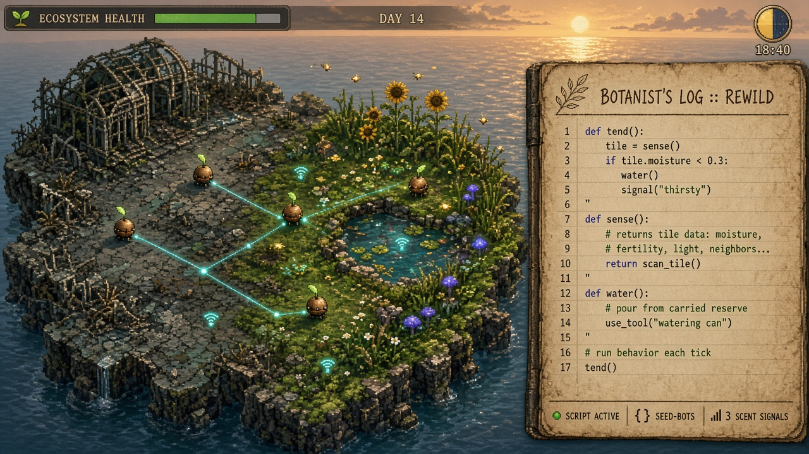
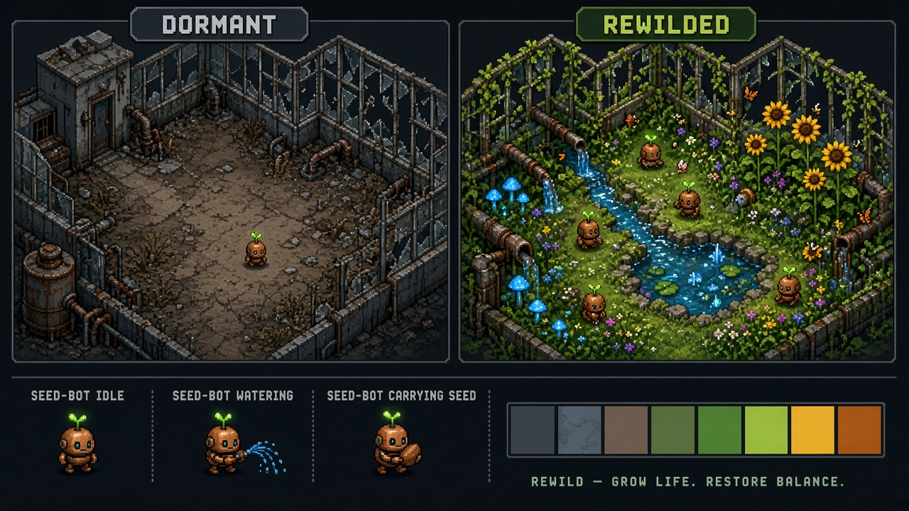

# Rewild — Game Design Plan

*Working title. A programming game where you bring a dead world back to life by coding a swarm of tiny robots.*



---

## 1. The pitch

Humanity left. The last automated seed vault, a ring of ruined greenhouse islands, wakes up
with almost nothing: one seed-bot, a handful of seeds, and a broken ecosystem.

You don't farm. You **write the behaviour of a swarm** of seed-bots, and they rebuild a living
ecosystem tile by tile. Progress isn't a number going up. **The world literally regains its
colour**: grey concrete turns to moss, dry pipes run with water, and bees and fireflies come back.

**One-line hook:** *"The Farmer Was Replaced" meets "Terra Nil", with a Zachtronics-style
optimisation layer. Code a swarm, not a drone. Grow an ecosystem, not a crop.*

---

## 2. How it's different from The Farmer Was Replaced

The Farmer Was Replaced is inspiration only. These are the deliberate departures:

| | The Farmer Was Replaced | Rewild |
|---|---|---|
| Who you program | One drone (more late game) | A **swarm** from early on; each bot runs its own copy of a *role* program |
| What you grow | Crops that turn into items | A **living ecosystem**: species affect each other (shade, nitrogen, pollination, spread, pests) |
| Progress | Research tree, resource counters | **Visual restoration** of zones, plus hardware **chips** installed into bots |
| Coordination | Mostly none | **Scent markers** and **signals** between bots (emergent swarm behaviour) |
| Constraint | Time | Time **and energy**: bots run on solar power, every instruction costs energy, and night forces efficient code |
| Knowledge | Documented rules | An **Almanac** you fill in by experimenting; ecosystem rules are discovered, not handed out |
| Goals | Open-ended grind | Open sandbox per zone **plus** "commissions" with score histograms (ops, energy, time, code size) and Steam leaderboards |

---

## 3. Design pillars

1. **Code is the only way to touch the world.** You never click a tile to plant. Everything happens through your programs.
2. **Systems, not recipes.** Good solutions come from understanding interactions (placement, timing, coordination), not from repeating a harvest loop.
3. **Life is the reward.** Every improvement is visible and audible: colour, animals, and music layers return.
4. **Readable complexity.** Every hidden stat (moisture, fertility, light, scent) has an overlay. Debugging is a first-class feature.
5. **Cozy, not punishing.** Things wilt, but nothing is lost permanently. Failure is information for the Almanac.

---

## 4. Core loop

```
 observe ──► write / tweak code ──► run (fast-forward) ──► ecosystem reacts
    ▲                                                          │
    └──── Almanac entries, new species, chips, zones ◄─────────┘
```

- **Minute to minute:** read overlays, adjust a role program, run, watch the swarm, and fix bugs with the step debugger.
- **Session:** restore a zone to a health threshold, which triggers the visual transformation, a new species or chip, and the next area.
- **Long term:** complete all islands, then optimise commissions for leaderboards and share programs on the Workshop.

---

## 5. Systems

### 5.1 The ecosystem

Every tile has **moisture, fertility, light, and life**. Species read and change these values:

| Species | Needs | Gives / affects | Unlocks |
|---|---|---|---|
| Moss | moisture | slowly turns concrete into soil | starting species |
| Clover | light | adds fertility (nitrogen) to neighbours | Zone 1 |
| Sunflower | high light, fertility | casts shade, attracts bees, gives seeds | Zone 1 |
| Reeds | standing water | filters water; pond tiles spread | Zone 2 |
| Glowcap mushroom | shade, dead matter | recycles wilted plants into fertility; glows at night | Zone 2 |
| Wildflowers | pollinators nearby | raise biodiversity score | Zone 3 |
| Bees (fauna) | flowers within a radius | pollination boosts growth | appear on their own |
| Blight (pest) | monocultures | spreads to plants of the same species | Zone 3 challenge |

**Zone health** = biodiversity × coverage × stability. Monocultures score badly and invite
blight, so optimal play is ecological design, not "fill the grid with the best crop".

### 5.2 The swarm

- You write **role programs** (for example `waterer.sprig` or `planter.sprig`) and assign bots to roles.
- Each bot has **chip slots** (2 at the start, up to 5). Chips are physical upgrades you find or craft:
  - *Sensor chip:* `sense()` returns full tile data instead of only `moisture`.
  - *Memory chip:* more variables and lists.
  - *Radio chip:* `signal()` and `on signal` handlers.
  - *Solar chip:* larger battery.
  - *Tool chips:* water can, seed pouch, trowel, pruner.
- **Loadouts are the strategy:** a cheap bot with a water chip and a small program, or a smart bot with a radio and sensor.

### 5.3 Scent markers and signals (the signature mechanic)

- `mark("thirsty")` leaves a glowing glyph on the current tile. It fades over time.
- `smell("thirsty")` returns the direction of the strongest nearby scent, or `None`.
- With a Radio chip, `signal("need_seeds", data)` broadcasts to all bots in range, and `on signal "need_seeds":` handles it.

This lets players discover real swarm patterns (ant trails, task queues, leader election)
without threads or locks. It's the thing no other programming game does this way, and it
looks great on screen as glowing threads between bots.

### 5.4 Energy and day/night

- Every instruction and action costs energy; solar chips recharge during the day.
- At night, bots with low batteries go dormant, **glowcaps light up**, and efficient code keeps working.
- This gives a natural rhythm to each session and a soft optimisation pressure without fail states.

### 5.5 The Almanac

- Every species and interaction has a hidden entry. It unlocks once your bots *observe* it
  (for example "Clover next to Sunflower: +fertility").
- It doubles as the in-game documentation for both the ecosystem and the language.

### 5.6 Commissions (puzzle mode)

- Hand-made small plots with a goal, such as "Reach 80% biodiversity on this 6×6 rooftop."
- Scored on **time, energy, instruction count, and lines of code**, with Zachtronics-style
  histograms against all players and Steam leaderboards.
- The simulation is deterministic, so replays and leaderboards are verifiable.

---

## 6. The language: "Sprig"

A **Python-flavoured** language. That keeps the skill transferable, which is a big part of
why people love The Farmer Was Replaced. The uniqueness comes from *semantics*, not odd syntax:
swarm roles, markers, events, and energy.

```python
# waterer.sprig: patrols, waters dry tiles, and calls planters to bare soil
def patrol():
    tile = sense()
    if tile.moisture < 0.3:
        water()
    if tile.is_bare and tile.fertility > 0.5:
        mark("plant_here")

on signal "drought":          # needs Radio chip
    go_to(nearest(Tiles.Pond))
    refill()

while True:
    patrol()
    trail = smell("dry")
    move(trail or random_dir())
```

```python
# planter.sprig: follows scent trails left by other bots
while True:
    spot = smell("plant_here")
    if spot:
        move(spot)
    elif sense().has_mark("plant_here"):
        plant(best_neighbour_species())
        clear_mark("plant_here")
    else:
        wander()
```

**Language features unlock through chips**, not a research tree:
- **Start:** `move`, `water`, `plant`, `if`, `while`.
- **Unlocked later through chips:** variables and functions (Memory), full `sense()` records
  (Sensor), lists and dicts (Memory II), `on signal` events (Radio), and `import` for sharing
  modules between roles (Archive).
- **Engineer mode setting:** all language features from the start, for experienced
  programmers who only want the ecosystem challenge.

**Tooling as a feature:**
- A real code editor with autocomplete, inline errors, and hover docs pulled from the Almanac.
- A **step debugger**: pause the world, step one bot, inspect its variables, and see its planned path as an overlay.
- **Replay scrubber**: rewind the simulation to see when a bug started.

---

## 7. Visual style



**Direction: "Dormant → Rewilded".** Colour *is* progress.

- **Perspective:** top-down 3/4 pixel art with 32px tiles. It's readable at a glance for a
  grid-based game, cheap to produce, and a proven look on Steam.
- **Palette:** two palettes per zone. *Dormant* is grey-blue concrete, rust and dry brown.
  *Rewilded* is moss green, sunflower amber and cyan glow. Each tile blends between them based
  on its local life value (a shader, not hand-drawn variants), so restoration spreads out
  organically from where the bots work.
- **Light as information:** a day/night cycle with dynamic 2D lighting. Glowcaps, bot
  antennas, scent glyphs and signal threads are the light sources at night, so code activity
  becomes literally visible.
- **Bots:** small copper seed-bots with a leaf antenna. The antenna colour shows the role, and
  expressive squash-and-stretch animation gives them personality. Swarms should feel like a
  cute ant colony.
- **UI:** diegetic. The editor is a **botanist's field journal** with paper texture, handwritten
  headers and monospace code. The Almanac is the same book, and overlays look like transparent
  map sheets laid over the world.
- **Audio:** adaptive music, where each species returning adds an instrument layer. The world
  sounds empty at first and becomes an orchestra by the end.
- **Signature moment:** when a zone crosses its health threshold, a wave of colour and sound
  sweeps across it. This is the screenshot and GIF moment for the Steam page.

**Production rules that keep this feasible:**
- Fixed 32px grid, a limited palette per biome, and the palette-blend shader instead of duplicated art.
- Plants are built from a few frames per growth stage, with sway animation done in a shader.
- Commission a small key-art set; the in-game art stays pixel art.

---

## 8. Tech stack (Steam-focused)

| Layer | Choice | Why |
|---|---|---|
| Engine | **Godot 4 (.NET / C#)** | Free, excellent 2D and lighting, `CodeEdit` control for the editor, easy desktop exports, Steam Deck friendly, consoles possible later |
| Language + simulation | **Pure C# library (`Rewild.Core`)**, no engine dependency | Unit-testable, deterministic, runs headless for leaderboard verification and CI |
| Interpreter | **Compiler to bytecode, plus a VM** with a per-bot instruction budget each tick | Hundreds of bots at 64× speed; exact energy and instruction counts; pause and step anywhere |
| Steam | Steamworks.NET or Facepunch.Steamworks | Achievements, Cloud saves, leaderboards, Workshop (share role programs and custom plots) |
| Tests | xUnit for Core, plus Godot headless smoke tests | The language and simulation are where the bugs will be |

What carries over from the current TypeScript prototype: the lexer and parser design and
the test cases port almost directly to C#. The generator-based interpreter gets replaced by the bytecode VM.

---

## 9. Roadmap

Milestones are defined by what must be true to move on, not by dates.

**M0: Paper and greybox prototype**
- Prototype the ecosystem rules (5 species, tile stats) and the scent mechanic in the existing
  TypeScript prototype, because it's the fastest place to experiment.
- *Exit when:* swarm coordination through scent is fun to watch, and there's a clear
  "aha, placement matters" moment.

**M1: Core in C#**
- `Rewild.Core`: Sprig lexer, parser, bytecode compiler, VM, deterministic tile and bot simulation, and a CLI runner.
- *Exit when:* all language tests pass, and 200 bots run at 64× speed within budget, headless.

**M2: First playable in Godot**
- Rendering, editor with highlighting and errors, run/pause/step, 1 zone, 3 species, and 1–3 bots.
- *Exit when:* a new player finishes the first zone without help.

**M3: Signature systems**
- Chips and loadouts, scent and signals, energy and day/night, overlays, step debugger, and the Almanac.

**M4: Vertical slice and Steam page**
- Zone 1 fully drawn, with the palette-blend shader, the restoration moment, and adaptive audio
  layers. Roughly an hour of polished play.
- Steam page, trailer GIFs, and a demo build for a Steam Next Fest.

**M5: Content**
- 4–5 biomes (greenhouse, marsh, orchard, fungal cavern, rooftop city), 30+ commissions,
  leaderboards, Workshop, and Engineer mode.

**M6: Launch polish**
- Onboarding pass, localisation, Steam Deck "Playable" rating (needs keyboard; add snippet
  palettes for controller), achievements, and Cloud saves.

---

## 10. Risks and mitigations

| Risk | Mitigation |
|---|---|
| Ecosystem too opaque, so players can't tell why things die | Overlays for every stat, Almanac entries with causes, and "why did this wilt?" inspection on click |
| Non-programmers bounce off | Tiny starting language, handwritten tutorial pages in the journal, snippets, and forgiving errors with suggestions |
| Swarm debugging becomes chaos | Step one bot, per-bot logs, replay scrubber, and colour-coded bot roles |
| Art scope | Palette-blend shader, a fixed grid, and limited frames; commission key art only |
| Performance with many bots | Bytecode VM with fixed instruction budgets, simulation off the main thread, and headless benchmarks in CI |
| Feels too close to The Farmer Was Replaced | Swarm, scent, ecosystem and restoration pillars are front and centre in the first 10 minutes and on the Steam page |

---

## 11. Open decisions

- Final name (alternatives: *Overgrow*, *Seedling Protocol*, *Moss & Machine*).
- Pixel art (recommended) versus painted 2D.
- How much of the language to gate behind chips by default versus Engineer mode.
- Solo developer, or with an artist? This decides how much content is realistic for M5.
